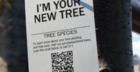
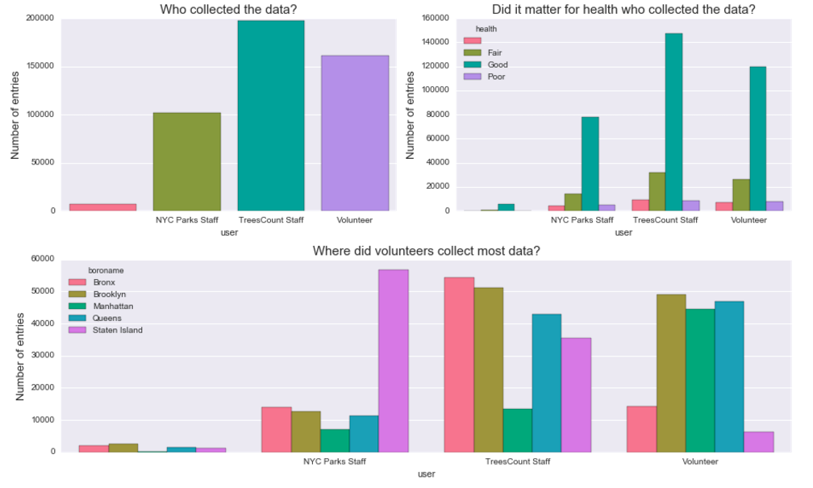
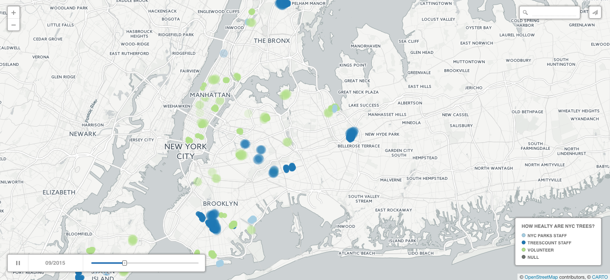
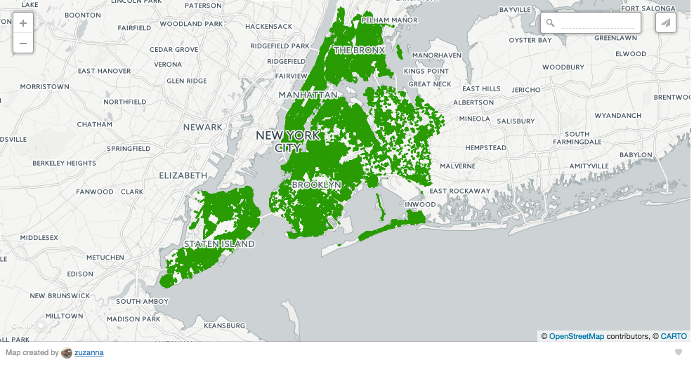
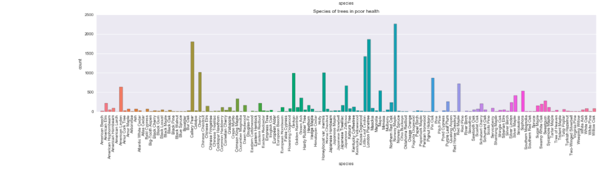
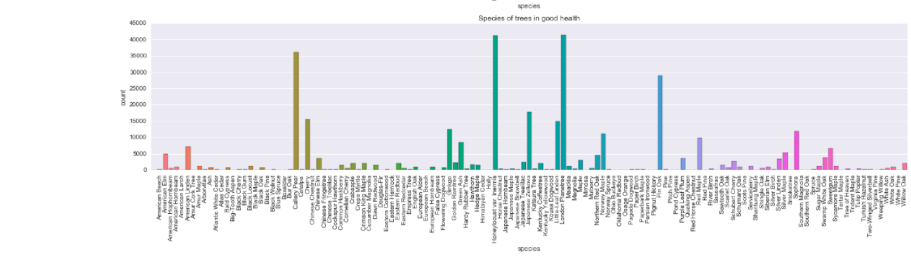

# Healthy NYC Trees

How can we use the Street Tree Census Data to more efficiently plan for the long term health of the urban forest? As part of TreesCount! 2015 on the National Day of Civic Hacking (06/04/16), NYC Parks has engaged with  voluntreers, tree-oriented community groups, and non-profit partners to identify how street tree census data can help improve equitable care of our urban forest. 

There were several themes to this hackathon and I chose to focus on two:

# 1. How can we use Street Tree Census Data to better engage with and target the efforts of community stewardship volunteers to improve the health of the urban forest?

Trees in urban settings face many challenges from both people and the environment. Tree stewardship by the community is an essential part of achieving urban forestry goals. Resources for tree care are finite, and so it is important that we better understand tree stewards and the challenges they face, and maximize the effectiveness of our volunteers by supporting their stewardship activity.

My goal was to explore Street Tree Census data to help understand who collects the most data, where stewardship efforts are most needed and what is the influence of seasonality on volunteer engagement. Turns out, even though the majority of data was collected by professional staff, a big chunk of it we have thanks to volunteers. By visual inspection of the distribution of data entries across boroughs we can see an interesting pattern emerge:

**Insights:** Looks like Manhattan, Brooklyn and Queens were favored by volunteer teams, with NYC Parks staff & TressCount staff leading the collection in the other boroughs. This came as a big surprise to me - in three out of five boroughs volunteers contributed between 45000 and 50000 entries! In Manhattan the difference is particurarly striking, volunteers entered approximately twice as many samples into the system as staff members. By contrast, in Bronx and Staten Island it was largely by staff efforts that we have a detailed map of the trees.

I suspected that if we look at the map it will be the farthest neighborhoods from Manhattan that were traversed by the staff. Mapping our data would also allow to quickly look at another variable which plays a role for volunteer programs: seasonality. For civic engagement time of the year definitely matters. For example, if a non-profit is planning an outdoor program, they will most likely avoid doing it in winter. Was it the case with the TreesCount! initiative?

## How did the data collection evolve over time? 

Are there any seasonal trends? Having data from just one year we can't use any reliable quantitative methods, such as ARIMA, so our observations are purely speculative.

The map below represents data entries within five boroughs recorded by three groups: staff (NYC Parks & TreesCount, in different shades of blue) and volunteers (green). Missing entries are plotted in grey. You can play around by changing the date of the records in the lower left corner.

**Source:** https://zuzanna.carto.com/viz/1583bbc6-d77f-11e6-af25-0e05a8b3e3d7/public_map **The map above is a static screenshot, in order to see seasonal changes you need to click on the link**

# 2. How can we use the Street Tree Census Data to more efficiently plan for the long term health and growth of the urban forest?

With the 1995 and 2005 street tree censuses, NYC Parks has been able to catalyze major advances in urban forest management, making science-based operational decisions and quantify the benefits of the urban forest. The coverage of the data is awesome:

**Source:** https://zuzanna.carto.com/viz/7317a0b0-d77d-11e6-83c6-0e05a8b3e3d7/public_map

## Key indicators of poor health

Is there a relationship between species and health? Let's look at a plot of simple counts of trees within each specie that were categorized as "healthy" and those that were described as being in "poor" health.

**Insights:** Visual inspection suggests there aren't striking differences between distribution of trees labeled as "healthy" versus "in fair health" (compare second and third plots), however there are some species that seem to be more prone to fall into the unhealthy category. For example, Cherry, Ginkgo or Little Leaf Linden's bars seem to be higher in the third compared to second plot. This might be simply because it's easier to notice the difference in species that are common in the data set (and are subsequently represented with higher bars) or that other species are less likely to be labeled as unhealthy.

## Forecasting which areas are likely to need more funds in the future

What drawn me to this project is that the data was collected with help of numerous volunteers during 2015 census. Those volunteers (and NYC Park staff) walked every street in NYC and laboriously recorded the GPS coordinates, species and health indicators of almost 500.000 trees. Isn't it amazing?
The dataset is available at https://nycopendata.socrata.com, feel free to play with it yourself, it's very well documented.