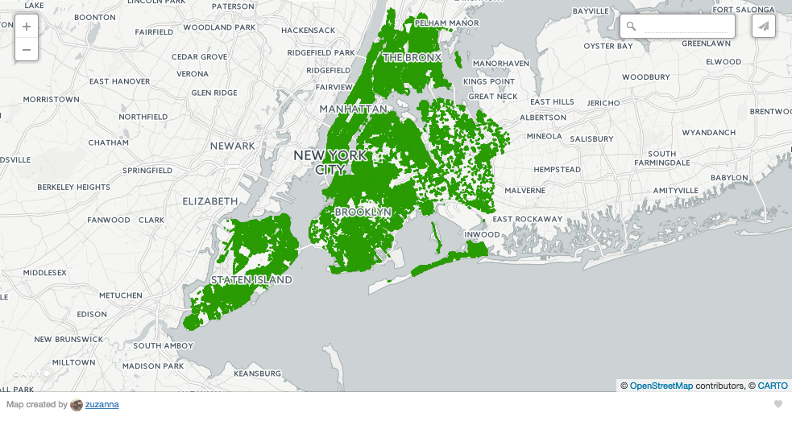

# Healthy NYC Trees

How can we use the Street Tree Census Data to more efficiently plan for the long term health of the urban forest? As part of TreesCount! 2015 on the National Day of Civic Hacking (06/04/16), NYC Parks has engaged with  voluntreers, tree-oriented community groups, and non-profit partners to identify how street tree census data can help improve equitable care of our urban forest. 

There were several themes to this hackathon and I chose to focus on one:

# How can we use the Street Tree Census Data to more efficiently plan for the long term health and growth of the urban forest?

With the 1995 and 2005 street tree censuses, NYC Parks has been able to catalyze major advances in urban forest management, making science-based operational decisions and quantify the benefits of the urban forest. In addition to understanding patterns in resource distribution and condition over time, long-term urban forest management decisions must consider factors such as climate change, pests, diseases, land use, and species diversity.

My goal was to gain actionable insights and:
* identify the key indicators of poor health
* forecast which areas are likely to need more funds in the future

To this aim I followed three step method:
* data import exploration
* analysis and modeling
* model validation

What drawn me to this project is that the data was collected with help of numerous volunteers during 2015 census. Those volunteers (and NYC Park staff) walked every street in NYC and laboriously recorded the GPS coordinates, species and health indicators of almost 500.000 trees. Isn't it amazing?
The dataset is available at https://nycopendata.socrata.com, feel free to play with it yourself, it's very well documented.