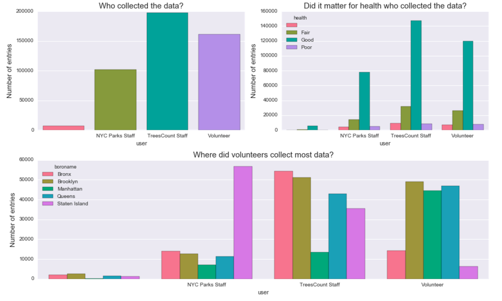
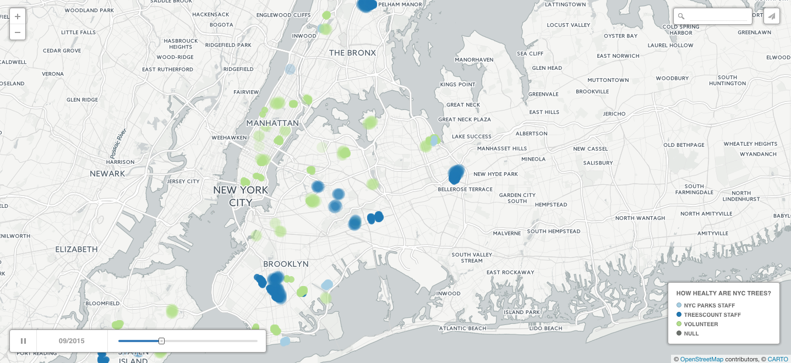
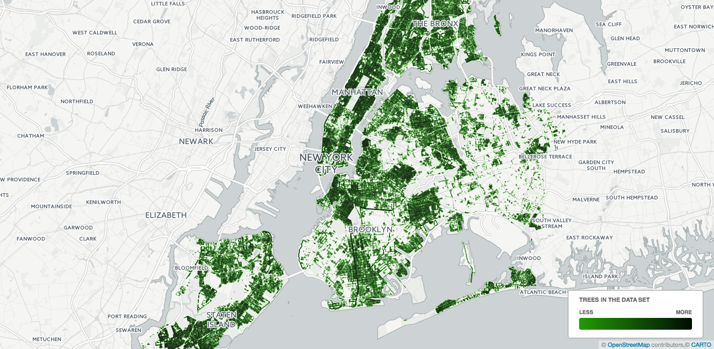
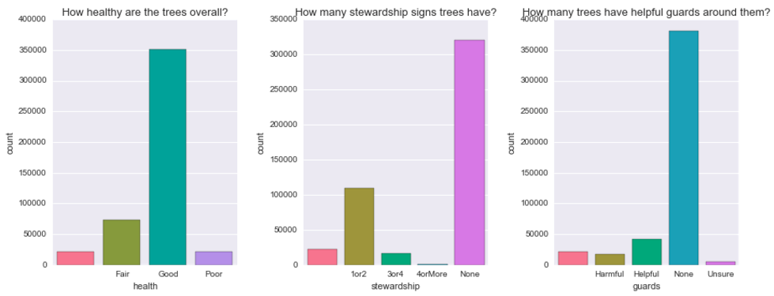
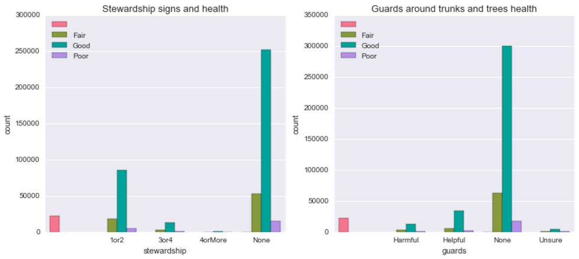
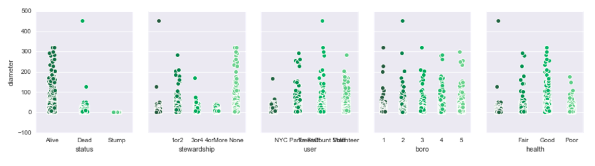
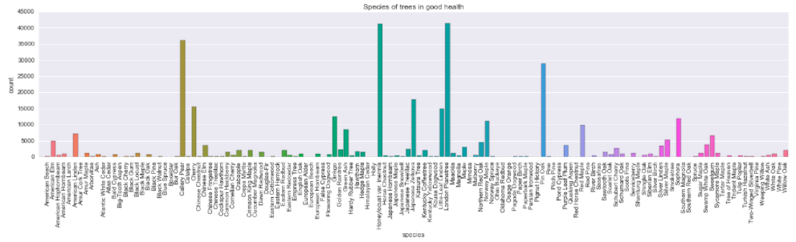
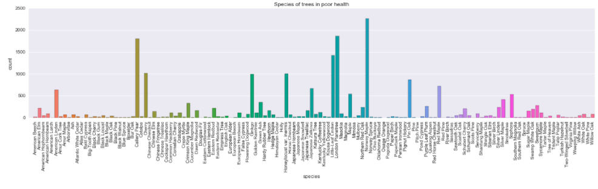
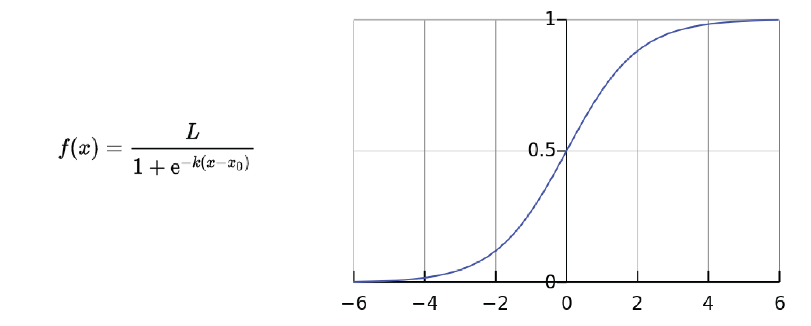

# Healthy NYC Trees

How can we use the Street Tree Census Data to more efficiently plan for the long term health of the urban forest? As part of TreesCount! 2015 on the National Day of Civic Hacking (06/04/16), NYC Parks has engaged with  voluntreers, tree-oriented community groups, and non-profit partners to identify how street tree census data can help improve equitable care of our urban forest. 

There were several themes to this hackathon and I chose to focus on two:

# How can we use Street Tree Census Data to better engage with and target the efforts of community stewardship volunteers to improve the health of the urban forest?

Trees in urban settings face many challenges from both people and the environment. Tree stewardship by the community is an essential part of achieving urban forestry goals. Resources for tree care are finite, and so it is important that we better understand tree stewards and the challenges they face, and maximize the effectiveness of our volunteers by supporting their stewardship activity.

My goal was to explore Street Tree Census data to help understand who collects the most data, where stewardship efforts are most needed and what is the influence of seasonality on volunteer engagement. Turns out, even though the majority of data was collected by professional staff, a big chunk of it we have thanks to volunteers. By visual inspection of the distribution of data entries across boroughs we can see an interesting pattern emerge:

**Insights:** Looks like Manhattan, Brooklyn and Queens were favored by volunteer teams, with NYC Parks staff & TressCount staff leading the collection in the other boroughs. This came as a big surprise to me - in three out of five boroughs volunteers contributed between 45000 and 50000 entries! In Manhattan the difference is particurarly striking, volunteers entered approximately twice as many samples into the system as staff members. By contrast, in Bronx and Staten Island it was largely by staff efforts that we have a detailed map of the trees.

I suspected that if we look at the map it will be the farthest neighborhoods from Manhattan that were traversed by the staff. Mapping our data would also allow to quickly look at another variable which plays a role for volunteer programs: seasonality. For civic engagement time of the year definitely matters. For example, if a non-profit is planning an outdoor program, they will most likely avoid doing it in winter. Was it the case with the TreesCount! initiative?

## How did the data collection evolve over time? 

Are there any seasonal trends? Having data from just one year we can't use any reliable quantitative methods, such as ARIMA, so our observations are purely speculative.

The map below represents data entries within five boroughs recorded by three groups: staff (NYC Parks & TreesCount, in different shades of blue) and volunteers (green). Missing entries are plotted in grey. You can play around by changing the date of the records in the lower left corner. **The map above is a static screenshot, in order to see seasonal changes you need to click on the link**

**Source:** https://zuzanna.carto.com/viz/1583bbc6-d77f-11e6-af25-0e05a8b3e3d7/public_map 

# How can we use the Street Tree Census Data to more efficiently plan for the long term health and growth of the urban forest?

With the 1995 and 2005 street tree censuses, NYC Parks has been able to catalyze major advances in urban forest management, making science-based operational decisions and quantify the benefits of the urban forest. The coverage of the data is awesome:

**Source:** https://zuzanna.carto.com/viz/7317a0b0-d77d-11e6-83c6-0e05a8b3e3d7/public_map

Looks like we have a solid coverage across the city, with clear gaps where parks* (e.g. Central Park) or airports are - which is a good sanity check. For now, I'm not looking at the density of the trees in the city, just checking if there are any obvious flaws to the dataset.

## Key indicators of poor health

Is there a relationship between species and health? Let's look at a plot of simple counts of trees within each specie that were categorized as "healthy" and those that were described as being in "poor" health.

In the first pass I will use just a subset of features choosing the ones that look like most likely candidates to influence trees health, such as trunk diameter, health status, location and species.

Is there a relationship between stewardship signs and health or between guards and health?

Doesn't seem like it. Just from visual inspection seems like, proportionally, there are more healthy than in "poor condition" trees among those that have no guards whatsoever compared to those that do have (helpful or harmful).
How about trees' diameter? Does it look like there is a difference on any of the above features depending on trees' diameter?

**Insights:** Well, who would have guessed? Dead trees have a smaller diameter than alive ones! Hah, but there could be something in there - it could mean, for example, that freshly planted trees which have a small diameter are in highest risk. This makes more sense when we look at the rightmost figure - it turns out that trees labeled in "good" health have also higher diameter. This relationship is further explored with the logistic regression and random forest models (you can read more about them in the python notebook).

What about different species? Are some of them more likely to be at health risk?

**Insights:** Visual inspection suggests there aren't striking differences between distribution of trees labeled as "healthy" versus "in fair health" (compare second and third plots), however there are some species that seem to be more prone to fall into the unhealthy category. For example, Cherry, Ginkgo or Little Leaf Linden's bars seem to be higher in the third compared to second plot. This might be simply because it's easier to notice the difference in species that are common in the data set (and are subsequently represented with higher bars) or that other species are less likely to be labeled as unhealthy.

# Classification of unhealthy trees with machine learning methods

Logistic function is often used in social and life sciences to describe phenomena with binary outcomes ("*no tumor / tumor present*"). I used it in my <a href="https://www.ncbi.nlm.nih.gov/pubmed/25240420">research</a> to describe how well we remember objects in visual space. There is nothing magical about it, in fact, you could also use cumulative <a href="https://en.wikipedia.org/wiki/Cumulative_distribution_function">normal</a>, <a href="https://en.wikipedia.org/wiki/Cauchy_distribution">Cauchy</a>, <a href="https://en.wikipedia.org/wiki/Gumbel_distribution">Gumbel</a> or <a href="https://en.wikipedia.org/wiki/Weibull_distribution">Weibull</a> (they differ slightly when it comes to asymptotes and other parameters). Basically, it can be described as:

Source: Wikipedia.org

Where *k* is the slope of the function (how steep it is) and *x_0* is the point where the *y* value is exactly 0.5 (sometimes called *threshold*). *Threshold* is an important indicator for determining bias in your data - for instance, if in the situation pictured above we add another curve where *x = 2* when *y = 0* it means that the whole function is shifted to the right but the dynamics of the phenomenon is essentially the same. If this second curve has a different *k* (or the *slope*) it means that the dynamics is different - the funcion asymptotes at *y = 1* faster or slower which has important implications for the interpretation of your results. 

Following the tumor example, lets say that the *x* axis is the size of tissue cluster and *y* the probability that it is a malignant tumor. Then, if they have a different threshold but the same slope the two curves could represent two different cell types which typically have different sizes (therefore, are shifted on the *x* axis) but follow a similar process when growing into a tumor (by the way, I have no idea about cancer, this is a made up example). If, however, they have different slope but the same threshold it means that for one cell type (with steeper slope) the probability of being a malignant tumor increases faster with size.

In classification tasks the threshold is the boundary of decision: that's the point above which we decide that this is a tumor and below we say it's just a lump of cells. 

## Additional readings about logistic:

1. As always, I recommend reviewing <a href="https://www.coursera.org/learn/machine-learning/home/week/3">Andrew Ng's ML lectures on logistic regression</a>
2. Classic, beautiful and thorough paper by <a href="ftp://ftp.snl.salk.edu/pub/reynolds/Flash_Jump/pdf944.pdf">Wichmann and Hill on fitting, sampling and goodness of fit of psychometric function</a>.
3. Amazing, very well written <a href="https://www.elsevier.com/books/psychophysics/kingdom/978-0-12-373656-7">introductory textbook to psychophysics along with code and examples by Kingdom and Prins. Worth recommending is also their Matlab and Octave toolbox <a href="http://www.palamedestoolbox.org">Palamedes</a> for fitting psychophysical data using MLA or Bayesian methods.

# Final thoughts 🌳😀

What drawn me to this project is that the data was collected with help of numerous volunteers during 2015 census. Those volunteers (and NYC Park staff) walked every street in NYC and laboriously recorded the GPS coordinates, species and health indicators of almost 500.000 trees. Isn't it amazing?

The dataset is available at https://nycopendata.socrata.com, feel free to play with it yourself, it's very well documented.